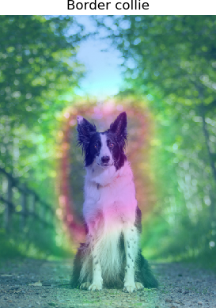

# Torchcam: class activation explorer

[](LICENSE) [](https://www.codacy.com/manual/frgfm/torch-cam?utm_source=github.com&amp;utm_medium=referral&amp;utm_content=frgfm/torch-cam&amp;utm_campaign=Badge_Grade)   [](https://codecov.io/gh/frgfm/torch-cam) [](https://frgfm.github.io/torch-cam)  [](https://pypi.org/project/torchcam/) 

Simple way to leverage the class-specific activation of convolutional layers in PyTorch.


## Table of Contents

* [Getting Started](#getting-started)
  * [Prerequisites](#prerequisites)
  * [Installation](#installation)
* [Usage](#usage)
* [Technical Roadmap](#technical-roadmap)
* [Documentation](#documentation)
* [Contributing](#contributing)
* [Credits](#credits)
* [License](#license)


## Getting started

### Prerequisites

- Python 3.6 (or more recent)
- [pip](https://pip.pypa.io/en/stable/)

### Installation

You can install the package using [pypi](https://pypi.org/project/torch-cam/) as follows:

```shell
pip install torchcam
```


## Usage

You can find a detailed example below to retrieve the CAM of a specific class on a resnet architecture.

```python
import requests
from io import BytesIO
from PIL import Image
import matplotlib.pyplot as plt
from torchvision.models import resnet50
from torchvision.transforms import transforms
from torchvision.transforms.functional import to_pil_image
from torchcam.cams import CAM, GradCAM, GradCAMpp
from torchcam.utils import overlay_mask


# Pretrained imagenet model
model = resnet50(pretrained=True)
# Specify layer to hook and fully connected
conv_layer = 'layer4'

# Hook the corresponding layer in the model
gradcam = GradCAMpp(model, conv_layer)

# Get a dog image
URL = 'https://www.woopets.fr/assets/races/000/066/big-portrait/border-collie.jpg'
response = requests.get(URL)

# Forward an image
pil_img = Image.open(BytesIO(response.content), mode='r').convert('RGB')
preprocess = transforms.Compose([
   transforms.Resize((224,224)),
   transforms.ToTensor(),
   transforms.Normalize([0.485, 0.456, 0.406], [0.229, 0.224, 0.225])
])
img_tensor = preprocess(pil_img)
out = model(img_tensor.unsqueeze(0))

# Select the class index
classes = {int(key):value for (key, value)
          in requests.get('https://s3.amazonaws.com/outcome-blog/imagenet/labels.json').json().items()}
class_idx = 232

# Use the hooked data to compute activation map
activation_maps = gradcam(out, class_idx)
# Convert it to PIL image
# The indexing below means first image in batch
heatmap = to_pil_image(activation_maps[0].cpu().numpy(), mode='F')

# Plot the result
result = overlay_mask(pil_img, heatmap)
plt.imshow(result); plt.axis('off'); plt.title(classes.get(class_idx)); plt.tight_layout; plt.show()
```




## Technical roadmap

The project is currently under development, here are the objectives for the next releases:

- [x] Parallel CAMs: enable batch processing.
- [ ] Benchmark: compare class activation map computations for different architectures.
- [ ] Signature improvement: retrieve automatically the last convolutional layer.
- [ ] Refine RPN: create a region proposal network using CAM.
- [ ] Task transfer: turn a well-trained classifier into an object detector.


## Documentation

The full package documentation is available [here](https://frgfm.github.io/torch-cam/) for detailed specifications. The documentation was built with [Sphinx](sphinx-doc.org) using a [theme](github.com/readthedocs/sphinx_rtd_theme) provided by [Read the Docs](readthedocs.org).


## Contributing

Please refer to `CONTRIBUTING` if you wish to contribute to this project.


## Credits

This project is developed and maintained by the repo owner, but the implementation was based on the following precious papers:

- [Learning Deep Features for Discriminative Localization](https://arxiv.org/abs/1512.04150): the original CAM paper
- [Grad-CAM](https://arxiv.org/abs/1610.02391): GradCAM paper, generalizing CAM to models without global average pooling. 
- [Grad-CAM++](https://arxiv.org/abs/1710.11063): improvement of GradCAM++ for more accurate pixel-level contribution to the activation.


## License

Distributed under the MIT License. See `LICENSE` for more information.