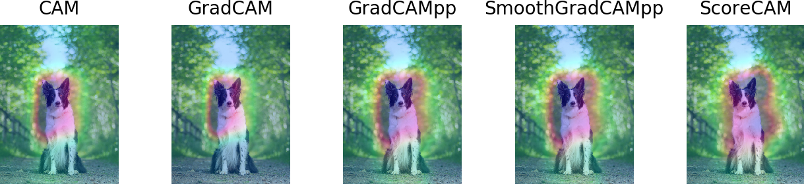

# TorchCAM: class activation explorer

[](LICENSE) [](https://www.codacy.com/gh/frgfm/torch-cam/dashboard?utm_source=github.com&amp;utm_medium=referral&amp;utm_content=frgfm/torch-cam&amp;utm_campaign=Badge_Grade)   [](https://codecov.io/gh/frgfm/torch-cam) [](https://frgfm.github.io/torch-cam)  [](https://pypi.org/project/torchcam/) 

Simple way to leverage the class-specific activation of convolutional layers in PyTorch.




## Quick Tour

### Setting your CAM

TorchCAM leverages [PyTorch hooking mechanisms](https://pytorch.org/tutorials/beginner/former_torchies/nnft_tutorial.html#forward-and-backward-function-hooks) to seamlessly retrieve all required information to produce the class activation without additional efforts from the user. Each CAM object acts as a wrapper around your model.

You can find the exhaustive list of supported CAM methods in the [documentation](https://frgfm.github.io/torch-cam/cams.html), then use it as follows:

```python
# Define your model
from torchvision.models import resnet18
model = resnet18(pretrained=True).eval()

# Set your CAM extractor
from torchcam.cams import SmoothGradCAMpp
cam_extractor = SmoothGradCAMpp(model)
```

*Please note that by default, the layer at which the CAM is retrieved is set to the last non-reduced convolutional layer. If you wish to investigate a specific layer, use the `target_layer` argument in the constructor.*


### Retrieving the class activation map

Once your CAM extractor is set, you only need to use your model to infer on your data as usual. If any additional information is required, the extractor will get it for you automatically.

```python
from torchvision.io.image import read_image
from torchvision.transforms.functional import normalize, resize, to_pil_image
from torchvision.models import resnet18
from torchcam.cams import SmoothGradCAMpp

model = resnet18(pretrained=True).eval()
cam_extractor = SmoothGradCAMpp(model)
# Get your input
img = read_image("path/to/your/image.png")
# Preprocess it for your chosen model
input_tensor = normalize(resize(img, (224, 224)) / 255., [0.485, 0.456, 0.406], [0.229, 0.224, 0.225])

# Preprocess your data and feed it to the model
out = model(input_tensor.unsqueeze(0))
# Retrieve the CAM by passing the class index and the model output
activation_map = cam_extractor(out.squeeze(0).argmax().item(), out)
```

If you want to visualize your heatmap, you only need to cast the CAM to a numpy ndarray:

```python
import matplotlib.pyplot as plt
# Visualize the raw CAM
plt.imshow(activation_map.numpy()); plt.axis('off'); plt.tight_layout(); plt.show()
```


Or if you wish to overlay it on your input image:

```python
import matplotlib.pyplot as plt
from torchcam.utils import overlay_mask

# Resize the CAM and overlay it
result = overlay_mask(to_pil_image(img), to_pil_image(activation_map, mode='F'), alpha=0.5)
# Display it
plt.imshow(result); plt.axis('off'); plt.tight_layout(); plt.show()
```


## Setup

Python 3.6 (or higher) and [pip](https://pip.pypa.io/en/stable/)/[conda](https://docs.conda.io/en/latest/miniconda.html) are required to install TorchCAM.

### Stable release

You can install the last stable release of the package using [pypi](https://pypi.org/project/torch-cam/) as follows:

```shell
pip install torchcam
```

or using [conda](https://anaconda.org/frgfm/torchcam):

```shell
conda install -c frgfm torchcam
```

### Developer installation

Alternatively, if you wish to use the latest features of the project that haven't made their way to a release yet, you can install the package from source:

```shell
git clone https://github.com/frgfm/torch-cam.git
pip install -e torch-cam/.
```


## CAM Zoo

This project is developed and maintained by the repo owner, but the implementation was based on the following research papers:

- [Learning Deep Features for Discriminative Localization](https://arxiv.org/abs/1512.04150): the original CAM paper
- [Grad-CAM](https://arxiv.org/abs/1610.02391): GradCAM paper, generalizing CAM to models without global average pooling. 
- [Grad-CAM++](https://arxiv.org/abs/1710.11063): improvement of GradCAM++ for more accurate pixel-level contribution to the activation.
- [Smooth Grad-CAM++](https://arxiv.org/abs/1908.01224): SmoothGrad mechanism coupled with GradCAM.
- [Score-CAM](https://arxiv.org/abs/1910.01279): score-weighting of class activation for better interpretability.
- [SS-CAM](https://arxiv.org/abs/2006.14255): SmoothGrad mechanism coupled with Score-CAM.
- [IS-CAM](https://arxiv.org/abs/2010.03023): integration-based variant of Score-CAM.
- [XGrad-CAM](https://arxiv.org/abs/2008.02312): improved version of Grad-CAM in terms of sensitivity and conservation.


## What else

### Documentation

The full package documentation is available [here](https://frgfm.github.io/torch-cam/) for detailed specifications.

### Demo app

A minimal demo app is provided for you to play with the supported CAM methods!

You will need an extra dependency ([Streamlit](https://streamlit.io/)) for the app to run:

```
pip install -r demo/requirements.txt
```

You can then easily run your app in your default browser by running:

```
streamlit run demo/app.py
```


### Example script

An example script is provided for you to benchmark the heatmaps produced by multiple CAM approaches on the same image:

```shell
python scripts/cam_example.py --model resnet18 --class-idx 232
```


All script arguments can be checked using `python scripts/cam_example.py --help`


## Contributing

Feeling like extending the range of possibilities of CAM? Or perhaps submitting a paper implementation? Any sort of contribution is greatly appreciated!

You can find a short guide in [`CONTRIBUTING`](CONTRIBUTING) to help grow this project!


## License

Distributed under the Apache 2.0 License. See [`LICENSE`](LICENSE) for more information.
