# Advanced usage

The [quick start](../index.md) uses a torchvision classifier, but TorchCAM works with many PyTorch classifiers. This
guide covers the questions that come up most often once you move past the basic example. Hitting an error rather
than a usage question? Jump to [Troubleshooting](troubleshooting.md).

## Model and task compatibility

TorchCAM needs a spatial feature tensor and a scalar output target to explain. The integration path depends on
what your model accepts and returns:

| Model or task | Support | What TorchCAM needs |
| --- | --- | --- |
| CNN classifier | Native | Class logits shaped `(N, num_classes)` and a spatial target layer. |
| Batched, 3D, or video classifier | Native | One class index per sample and the correct `input_shape`. |
| Multi-input model | Adapter required | Wrap the inputs into one tensor argument while preserving the hooked path. |
| Tensor or per-sample list output | Native with `targets` | Reduce each sample output to one scalar tensor. |
| torchvision VisionTransformer | Native with `LeGrad` | Target supported encoder blocks; other CAM methods need `reshape_transform`. |
| timm or Hugging Face CNN | Native (timm) or logits wrapper (Hugging Face) | See [timm and Hugging Face models](#timm-and-hugging-face-models). |
| Other ViT or Swin classifier | Adapter required | Set `target_layer` and reshape tokens with `reshape_transform`; `LeGrad` only supports the contract below. |
| Detection, segmentation, embedding, or other output | Native with `targets` | Define a scalar target; gradient methods require it to remain differentiable. |
| Multimodal language model | State adapter with `TAM` | Final language-model image/text states, context token IDs, and a linear vocabulary head. |

## Use your own model

TorchCAM's class-index API works with an `nn.Module` whose forward returns logits of shape `(N, num_classes)` — it
is not limited to torchvision. The `targets` API below also supports other batched outputs. In both cases, tell the
extractor which layer to read the activations from.

List the candidate layers by name:

```python
for name, module in model.named_modules():
    print(name, "->", type(module).__name__)
```

Then pass the name **or** the module itself as `target_layer`:

```python
from torchcam.methods import SmoothGradCAMpp

cam_extractor = SmoothGradCAMpp(model, target_layer="features.7")        # by name
# equivalently
cam_extractor = SmoothGradCAMpp(model, target_layer=model.features[7])   # by module
```

If you omit `target_layer`, TorchCAM runs a dummy forward of shape `(1, *input_shape)` (default
`(3, 224, 224)`), picks the last layer whose output still has spatial dimensions, and logs the choice. If your
model expects a different input, set `input_shape` accordingly — otherwise the dummy forward will fail or pick
the wrong layer:

```python
cam_extractor = LayerCAM(model, input_shape=(3, 384, 384))
```

## Choosing the target layer

A CAM is computed on the activation map of a **convolutional (spatial)** layer. The default — the last
convolutional layer before global pooling — is the most class-discriminative but also the coarsest. Earlier
layers give finer, less semantic maps. Rules of thumb for common torchvision backbones:



| Architecture          | Typical `target_layer`   | `fc_layer` for `CAM`                 |
| --------------------- | ------------------------ | ------------------------------------ |
| ResNet / ResNeXt      | `"layer4"`               | `"fc"`                               |
| DenseNet              | `"features"`             | `"classifier"`                       |
| MobileNet v2          | `"features"`             | `"classifier.1"`                     |
| EfficientNet          | `"features"`             | `"classifier.1"`                     |
| MobileNet v3          | `"features"`             | *two `Linear` layers — `CAM` n/a*    |
| VGG                   | `"features"`             | *three `Linear` layers — `CAM` n/a*  |
| SqueezeNet            | `"features"`             | *no `Linear` head — `CAM` n/a*       |

!!! note "When does the base `CAM` work?"
    `CAM` needs **exactly one** `nn.Linear` classification head fed by global pooling, and resolves it
    automatically. It therefore works for ResNet, DenseNet, MobileNet v2, EfficientNet, etc., but **not** for
    models with several linear layers (VGG, MobileNet v3) or none (SqueezeNet) — there, use a gradient- or
    score-based method, or pass a compatible `fc_layer` explicitly. All the other methods have no such
    requirement.

You can also pass a **list** of layers and fuse them — `LayerCAM` benefits a lot from this:

```python
from torchcam.methods import LayerCAM

with LayerCAM(model, ["layer2", "layer3", "layer4"]) as cam_extractor:
    out = model(input_tensor)
    class_idx = out.squeeze(0).argmax().item()
    cams = cam_extractor(class_idx, out)        # one map per layer
    fused = cam_extractor.fuse_cams(cams)       # single fused map
```

`RefineCAM` formalizes multi-layer fusion by normalizing and multiplying the maps. It requires at least two target
layers and uses `GradCAMpp` as its base method by default. Pass another extractor class to reuse its weighting:

```python
from torchcam.methods import LayerCAM, RefineCAM

with RefineCAM(model, ["layer2", "layer3", "layer4"], base_method=LayerCAM) as cam_extractor:
    out = model(input_tensor)
    refined = cam_extractor(out.squeeze(0).argmax().item(), out)[0]
```

`FinerCAM` instead changes **what** a gradient method explains. For target class $c$ and reference classes $d_t$,
it replaces the target score with the contrastive objective

$$
y_c - \gamma \frac{1}{T} \sum\limits_{t=1}^{T} y_{d_t}.
$$

The references are averaged before the base method's final CAM ReLU. By default, `gamma=0.6` and up to three
classes whose logits are closest to the target logit are selected automatically, excluding the target. Pass an
integer or flat list to share explicit references across the batch, or an equal-width nested list with one row per
sample. Explicit references override `num_references`.

```python
from torchcam.methods import FinerCAM, LayerCAM

with FinerCAM(model, "layer4", base_method=LayerCAM) as cam_extractor:
    out = model(input_tensor)
    class_idx = out.squeeze(0).argmax().item()
    cams = cam_extractor(class_idx, out, comparison_idx=[12, 37, 84])
```

`FinerCAM` supports `GradCAM`, `GradCAMpp`, and `LayerCAM`, requires the original differentiable score tensor, and
returns one tensor per selected layer. Its intended behavior is improved discrimination between fine-grained
classes; it is not a universal guarantee of better localization. Score-based CAM methods are not approximated.

## Understanding targets and the call signature

```python
cam_extractor(class_idx=None, scores=None, normalized=True, *, targets=None)
```

- **`class_idx`** (`int` or `list[int]`) — the index, in the output logits, of the class you want to explain.
  To explain the top prediction use the argmax (`out.squeeze(0).argmax().item()`), but you can pass **any** valid
  index to see where the model looks for that class. For a batch, pass one index per sample (see below).
- **`scores`** — the raw model output. `class_idx` expects a tensor shaped `(N, num_classes)`; `targets` accepts a
  batched tensor or one list item per sample. Required by gradient methods; ignored by `LeGrad`,
  `SmoothGradCAMpp`, and `CAM`. The Score-CAM family re-runs the stored input, so `scores` can be omitted.
- **`targets`** — one callable shared by the batch or one callable per sample. Each callable receives one sample's
  model output and must return a scalar tensor. Pass exactly one of `class_idx` or `targets`.
- **`normalized`** — when `True` (default) each map is min-max normalized to `[0, 1]`, which is what you want for
  visualization/overlay. Pass `normalized=False` to get the raw weighted maps, e.g. when comparing magnitudes
  across layers before fusing them yourself.
- **Returns** a `list` of activation maps, **one tensor per hooked layer**, each of shape `(N, H, W)`. With a
  single layer and a single image, the map you want is `cams[0].squeeze(0)`. `LeGrad` and `RefineCAM` instead
  return a one-element list containing their final fused map.

Gradient-based extractors also accept `retain_graph=True` (forwarded to the gradient computation), needed when you call
the extractor several times after a single forward — see
[Troubleshooting](troubleshooting.md#runtimeerror-trying-to-backward-through-the-graph-a-second-time).

`targets` opens the same extractor API to dense predictions and embeddings without a task-specific adapter. For a
segmentation tensor shaped `(N, classes, H, W)`, explain class 5 inside a region mask:

```python
with LayerCAM(model, target_layer="backbone.layer4") as cam_extractor:
    output = model(input_batch)
    cams = cam_extractor(scores=output, targets=lambda sample: sample[5][region_mask].mean())
```

For an embedding tensor shaped `(N, embedding_dim)`, the target can be its similarity to another embedding:

```python
import torch.nn.functional as F

target = lambda embedding: F.cosine_similarity(embedding, text_embedding, dim=0)
with LayerCAM(model, target_layer="visual.layer4") as cam_extractor:
    image_embeddings = model(input_batch)
    cams = cam_extractor(scores=image_embeddings, targets=target)
```

Tensor outputs are split along their batch dimension. A model may instead return a list with one item per sample,
such as detection dictionaries; in that case each target receives the corresponding item. `GradCAM`,
`GradCAMpp`, `SmoothGradCAMpp`, `XGradCAM`, `LayerCAM`, `ScoreCAM`, `SSCAM`, and `ISCAM` support this contract, as
does `RefineCAM` when its base method supports it. `CAM`, `FinerCAM`, and `LeGrad` retain their specialized
class-based objectives.

## Batched inputs

Batches are supported: pass a list of class indices whose length matches the batch size.

```python
import torch
from torchcam.methods import GradCAM

input_batch = torch.stack([img1, img2, img3])   # (3, C, H, W)
with GradCAM(model) as cam_extractor:
    out = model(input_batch)                     # (3, num_classes)
    class_ids = out.argmax(dim=1).tolist()       # one class per sample
    cams = cam_extractor(class_ids, out)         # cams[0] has shape (3, H, W)
```

## Models with multiple inputs or batched dictionary outputs

The hooked layer must output a tensor. `targets` handles a batched tensor or a list containing one output per sample.
Tuple outputs such as `(logits, aux)`, one dictionary containing batched tensors, and models taking several inputs
(e.g. a siamese network) need a thin wrapper around that boundary:

```python
import torch.nn as nn
from torchcam.methods import GradCAM

class LogitsOnly(nn.Module):
    def __init__(self, model):
        super().__init__()
        self.model = model

    def forward(self, x):
        return self.model(x)[0]          # keep the logits, drop the rest

wrapped = LogitsOnly(model)
cam_extractor = GradCAM(wrapped, target_layer=wrapped.model.backbone.layer4)  # pass the module directly
```

Passing the **module object** (rather than its name) sidesteps the naming gotcha: wrapping shifts every layer
name under a `"model."` prefix, so a hard-coded string like `"backbone.layer4"` would raise a `ValueError`. If
you prefer names, discover the correct one *after* wrapping:

```python
print([n for n, _ in wrapped.named_modules() if n.endswith("layer4")])
# -> ['model.backbone.layer4']
```

## timm and Hugging Face models

[timm](https://huggingface.co/docs/timm) classifiers return logits, so every API works as-is, including automatic
target-layer resolution:

```python
from urllib.request import urlretrieve
import timm
from PIL import Image
from torchcam.explain import explain

urlretrieve("https://github.com/pytorch/hub/raw/master/images/dog.jpg", "dog.jpg")
image = Image.open("dog.jpg").convert("RGB")
model = timm.create_model("resnet50.a1_in1k", pretrained=True).eval()
transform = timm.data.create_transform(**timm.data.resolve_data_config({}, model=model))
result = explain(model, transform(image).unsqueeze(0))
```

Hugging Face `transformers` classifiers return an output object whose first item is the logits, so the
`LogitsOnly` wrapper above works as-is:

```python
from transformers import AutoImageProcessor, AutoModelForImageClassification

processor = AutoImageProcessor.from_pretrained("microsoft/resnet-50")
model = LogitsOnly(AutoModelForImageClassification.from_pretrained("microsoft/resnet-50")).eval()
input_tensor = processor(images=image, return_tensors="pt")["pixel_values"]
labels = model.model.config.id2label
result = explain(model, input_tensor, class_names=[labels[index] for index in range(len(labels))])
```

Transformer-based timm and Hugging Face classifiers (ViT, DeiT, Swin) also need an explicit `target_layer` and a
`reshape_transform`, as described below.

## Vision Transformers and other non-CNN models

The [Vision Transformers notebook](https://github.com/frgfm/notebooks/blob/main/torch-cam/vision_transformers.ipynb) ([Colab](https://colab.research.google.com/github/frgfm/notebooks/blob/main/torch-cam/vision_transformers.ipynb)) compares LeGrad attention gradients with GradCAM after token reshaping on a pretrained torchvision ViT.

TorchCAM's methods operate on **spatial feature maps** of shape `(N, C, H, W)` (or `(N, C, D, H, W)` in 3D).
Transformer blocks emit token sequences of shape `(N, num_tokens, dim)`, which have no spatial grid, so CAM methods
do not apply directly and automatic `target_layer` resolution cannot infer the token layout.

Use `reshape_transform` to convert the hooked tokens and their gradients back to a spatial grid. For a torchvision
ViT, drop the class token, reshape the remaining patch tokens, and move the embedding dimension before the spatial
dimensions:



```python
from PIL import Image
from torchvision.models import ViT_B_16_Weights, vit_b_16
from torchcam.methods import GradCAM

weights = ViT_B_16_Weights.DEFAULT
model = vit_b_16(weights=weights).eval()
grid_size = model.image_size // model.patch_size
image = Image.open("path/to/image.jpg").convert("RGB")

def reshape_transform(tensor):
    patches = tensor[:, 1:, :].reshape(tensor.size(0), grid_size, grid_size, tensor.size(-1))
    return patches.permute(0, 3, 1, 2)

input_tensor = weights.transforms()(image).unsqueeze(0)
target_layer = model.encoder.layers[-2].ln_1

with GradCAM(model, target_layer, reshape_transform=reshape_transform) as extractor:
    scores = model(input_tensor)
    cam = extractor(scores[0].argmax().item(), scores)[0]
```

DeiT-Tiny follows the same pattern: target `model.blocks[-1].norm1`, drop `model.num_prefix_tokens`, and reshape
the remaining tokens using `model.patch_embed.grid_size`.

For a complete example without additional dependencies, run the official pretrained torchvision Swin-T
(patch size 4, window size 7, input size 224) from the repository checkout:

```bash
uv run --extra scripts python scripts/cam_example.py \
    --arch swin_t --method GradCAM \
    --savefig swin_t_cam.png --noblock
```

The first run downloads the torchvision Swin-T weights. The script selects the model prediction and targets the
final block's `norm2`. This layer retains a 7×7 channels-last spatial grid, so its transform only moves the channel
axis before the spatial axes.

The exact transform is architecture-specific: models may use a different patch grid or have additional prefix
tokens such as a distillation token. Always specify `target_layer` when using `reshape_transform`. For a ViT,
choose a layer before the final attention operation; patch-token gradients are zero at the complete final block
output because classification uses only the class token. The selected module must return a tensor, and the same
transform is applied to every selected target layer. Keep the transform structural—token selection, reshaping, and
axis permutation—because TorchCAM applies it identically to activation and gradient tensors.

This enables activation- and gradient-based extractors such as `LayerCAM`, `GradCAM`, and `ScoreCAM`. The original
weight-based `CAM` method still requires its global-pooling and classifier-weight assumptions, which standard ViTs
do not satisfy. Attention rollout or attention flow are separate transformer-specific explanation techniques.

### LeGrad for torchvision Vision Transformers

[`LeGrad`](../reference/methods.md#torchcam.methods.LeGrad) uses the positive gradient of each layer-specific class
score with respect to the post-softmax attention probabilities. For layer $l$, head $h$, query $q$, and key $k$:

$$
E^l_k = \frac{1}{H Q} \sum_{h,q} \operatorname{ReLU}\left(\frac{\partial s^l}{\partial A^l_{h,q,k}}\right),
\qquad
E = \operatorname{normalize}\left(\frac{1}{L} \sum_l \operatorname{reshape}(E^l_{\text{patch keys}})\right).
$$

LeGrad does **not** multiply gradients by attention values. That multiplication is AttentionCAM. It also differs
from GradCAM-on-tokens, which weights token activations, and attention rollout, which multiplies attention matrices
across layers.

For torchvision `VisionTransformer`, target complete encoder blocks. The default layer score averages that block's
tokens, then applies `model.encoder.ln` and `model.heads` as the shared classifier projection:

```python
from torchvision.models import ViT_B_16_Weights, vit_b_16
from torchcam.methods import LeGrad

weights = ViT_B_16_Weights.DEFAULT
model = vit_b_16(weights=weights).eval()
input_tensor = weights.transforms()(image).unsqueeze(0)
target_layers = list(model.encoder.layers)[-4:]

with LeGrad(model, target_layers, prefix_tokens=1) as extractor:
    scores = model(input_tensor)
    cam = extractor(scores[0].argmax().item())[0]
```

The 196 patch keys form a square 14×14 grid, so `grid_shape` is inferred. Pass `grid_shape=(height, width)` for a
non-square patch layout. Custom models must provide `score_projection(tokens) -> logits` and meet every condition
below:

| Requirement | Supported contract |
| --- | --- |
| Target output | One tensor shaped `(batch, tokens, embedding)`. |
| Attention | Direct `self_attention` child using batch-first, shared-dimension `nn.MultiheadAttention`. |
| Attention mode | Self-attention without added key/value tokens or active attention dropout. |
| Prefix/grid | Configurable prefix count; square grid inferred or non-square grid specified explicitly. |

Swin, timm, OpenCLIP, cross-attention, attentional poolers, and arbitrary transformer layouts are not supported by
this initial implementation. Run the model with gradient tracking enabled; `torch.no_grad()` and
`torch.inference_mode()` cannot produce LeGrad maps.

## 3D and video models

Volumetric inputs work out of the box: set `input_shape` to your 3D input shape as `(C, D, H, W)` (i.e. excluding
the batch dimension) and the resulting map has shape `(N, D, H, W)`. Visualize it slice by slice:

```python
import matplotlib.pyplot as plt
from torchcam.methods import GradCAM

cam_extractor = GradCAM(model, target_layer="...", input_shape=(1, 64, 128, 128))
out = model(volume)                                  # volume: (N, C, D, H, W)
cam = cam_extractor(out.squeeze(0).argmax().item(), out)[0]   # (N, D, H, W)
plt.imshow(cam[0, 32].cpu().numpy())                 # one depth slice
```

Video models that output `(N, C, T, H, W)` features are handled the same way (the temporal axis behaves like an
extra spatial dimension). Note that `overlay_mask` works on 2D PIL images, so overlay each slice/frame separately.

## Choosing a CAM method

| Method                      | Needs gradients | Relative cost            | Notes |
| --------------------------- | --------------- | ------------------------ | ----- |
| `CAM`                       | no              | cheapest                 | needs global pooling + a **single** `nn.Linear` head (e.g. ResNet); fails on multi-FC heads like VGG |
| `GradCAM`                   | yes             | one backward pass        | robust default for most CNNs |
| `LayerCAM`                  | yes             | one backward pass        | best localization in our benchmark; ideal when fusing layers |
| `FinerCAM`                  | yes             | one backward pass        | contrastive fine-grained cues with `GradCAM`, `GradCAMpp`, or `LayerCAM` |
| `LeGrad`                    | yes             | one gradient per selected layer | attention-gradient maps for supported torchvision-style ViTs |
| `RefineCAM`                 | depends on base | base method + cheap fusion | high-resolution fusion across at least two layers; defaults to `GradCAMpp` |
| `GradCAMpp` / `XGradCAM`    | yes             | one backward pass        | alternative weighting schemes |
| `SmoothGradCAMpp`           | yes             | `num_samples` forwards   | sharper maps via noise averaging |
| `ScoreCAM` / `SSCAM` / `ISCAM` | no           | many forwards (slow)     | gradient-free; tune `batch_size`; useful when gradients are unavailable |

See the latency and faithfulness benchmarks in the [README](https://github.com/frgfm/torch-cam#performance-benchmarks)
for concrete numbers, and the [methods reference](../reference/methods.md) for the full API.

## Token activation maps for VLMs

[`TAM`](../reference/methods.md#torchcam.methods.TAM) explains which image regions activate a selected vocabulary token.
It uses final **language-model** states, rather than the vision encoder's features, and requires no gradients,
hooks, or extra model inference. Earlier text's estimated interference is removed before rank Gaussian smoothing.

The example below explains the first greedy answer token for a prepared Hugging Face Qwen2.5-VL model, processor,
and `inputs`. It assumes **one image and batch size one**. Transformers is only needed by the caller.

```python
import torch
from torchcam.methods import TAM

with torch.inference_mode():
    output = model(**inputs, output_hidden_states=True, logits_to_keep=1, use_cache=False)
states = output.hidden_states[-1]  # (1, sequence, language_model_width), after the final norm
input_ids = inputs["input_ids"][0]
image_mask = input_ids == model.config.image_token_id
special_ids = torch.tensor(processor.tokenizer.all_special_ids, device=input_ids.device)
text_mask = ~torch.isin(input_ids, special_ids) & inputs["attention_mask"][0].bool()
text_mask &= ~image_mask
merge = model.config.vision_config.spatial_merge_size
height, width = (int(dim) // merge for dim in inputs["image_grid_thw"][0, 1:])

extractor = TAM(model.get_output_embeddings())
maps = extractor(
    token_id=output.logits[:, -1].argmax(-1).tolist(),
    visual_features=states[:, image_mask].reshape(1, height, width, states.shape[-1]),
    context_features=states[:, text_mask],
    context_ids=inputs["input_ids"][:, text_mask],
)  # Tensor (1, height, width); use maps[0] with overlay_mask
```

For later answer tokens, retain the initial visual states and extend the text context with earlier generated IDs
and the final states that predicted them. Explain the current token before adding it to that context.
Other architectures need their own image-token selection and spatial ordering; this example does not establish
automatic support for every VLM, multi-image layout, video, or quantized output head.

TAM returns only visual maps, normalized independently per image; `normalized=False` retains their raw scale.
Repeated context IDs matching the target are excluded, an empty context is supported, and `kernel_size=1` disables
smoothing. Half-precision states are accumulated in float32. This implementation selects only the relevant output
weights instead of materializing image-token logits for the entire vocabulary. It implements the visual algorithm
from the [paper](https://arxiv.org/abs/2506.23270), without the reference application's text rendering or joint
image/text normalization. Its maps are estimates of visual relevance, not proof of a causal explanation.

### DEX-AR for generated tokens and answers

[`DEXAR`](../reference/methods.md#torchcam.methods.DEXAR) differentiates each layer's own token logit against its
post-softmax attention. Heads with stronger positive visual than textual gradients contribute to token maps;
visual relevance weights combine normalized token maps into an answer map.

```python
from torchcam.methods import DEXAR

extractor = DEXAR((height, width))  # rectangular grids supported
maps, weights = extractor(layer_logits, layer_attentions, visual_mask)
sequence = extractor.aggregate(token_maps, token_weights)  # (N, tokens, H, W), (N, tokens)
```

Supply connected attention tensors and selected logits from an unpadded prefix **before** appending the target
ID. Apply the final norm once; preserve generated IDs rather than retokenizing text. The API documents tensor
shapes. Model extraction stays outside the core; Transformers is optional.

The [Qwen2.5-VL example](https://github.com/frgfm/torch-cam/blob/main/scripts/dexar_example.py) targets Transformers
4.51.3, eager language attention, batch size one, one still image and an unquantized head. Replay caches preceding
keys and values; a regression test checks it against full-prefix attribution:

```shell
uv pip install 'transformers==4.51.3'
python scripts/dexar_example.py --image /path/to/image.jpg --output /tmp/dexar-demo
```

It saves the generated answer/IDs, input, token/sequence overlays labelled with token text, ID and answer position,
and separate loading, generation and attribution timings. CPU defaults to float32 language layers and a frozen
bfloat16/SDPA vision encoder. Tokens may be subwords. This Qwen adaptation has no localization benchmark;
the paper evaluates other architectures. Coarse grids and contextual evidence can yield diffuse or misplaced
highlights. Other models, newer Transformers layouts, video, padding and multiple images need their own extraction.

We follow [paper equations (4)-(6) and Appendix G.1](https://arxiv.org/abs/2603.06302): positive gradients and
individually normalized token maps for sequence aggregation. The [reference at `07830a1`](https://github.com/WalBouss/DEX-AR/blob/07830a1e435eacde0acc68b31467681a236dc3a7/dexar/wrapper.py)
instead globally normalizes gradients and aggregates raw token maps. Omitting that global normalization and
using equation (6) avoids adding raw-map amplitudes to token relevance weights. All nonvisual keys, including
special tokens, participate in textual relevance; constant maps and zero weights yield finite zeros.

## Using CAM during or after training

CAM methods are **post-hoc**: run them on a trained model in `eval()` mode to interpret its predictions — they
are not a training objective. To quantify how faithful a method is on your own data, use the
[`ClassificationMetric`](../reference/metrics.md).
Metrics re-run masked or perturbed inputs in batches, so the model must support batched inference and return the
same output structure for those forwards.
