# TorchCAM: class activation explorer

TorchCAM provides a minimal yet flexible way to explore the spatial importance of features on your model's classification outputs. Check out the live demo on [HuggingFace Spaces](https://huggingface.co/spaces/frgfm/torch-cam) 🤗

<p align="center">
    
</p>
<p align="center">
    <em>Source: image from <a href="https://www.woopets.fr/assets/races/000/066/big-portrait/border-collie.jpg">woopets</a> (activation maps created with a pretrained <a href="https://pytorch.org/vision/stable/models.html#torchvision.models.resnet18">Resnet-18</a>)</em>
</p>

This project is meant for:

* ⚡ **exploration**: easily assess the influence of spatial features on classification outputs
* 🐛 **debugging**: compare predicted and expected classes, and save evidence that humans and AI agents can verify
* 👩‍🔬 **research**: quickly implement your own ideas for new CAM methods

## Installation

Create and activate a virtual environment and then install TorchCAM:

```shell
pip install torchcam
```

Check out the [installation guide](getting-started/installation.md) for more options.

Having issues with gradients, hooks, or layer selection? See the [troubleshooting guide](getting-started/troubleshooting.md).

## Quick start

To explain one prediction and save the evidence, see [Debug one prediction](getting-started/debug-prediction.md). For full control, use a CAM extractor directly. Get an image and a model:

--8<-- "README.md:quickstart-input"

Compute the class activation map:

--8<-- "README.md:quickstart-cam"

`class_idx` (the first argument) is the index in the model's output logits of the class to explain; `argmax` picks the top prediction, but any class index works. The call returns one activation map per target layer. See [Advanced usage](getting-started/advanced-usage.md) for batches, custom models and method selection.



Display it:

--8<-- "README.md:quickstart-overlay"


## CAM zoo

### Activation-based methods
   * CAM from ["Learning Deep Features for Discriminative Localization"](https://arxiv.org/pdf/1512.04150.pdf)
   * Score-CAM from ["Score-CAM: Score-Weighted Visual Explanations for Convolutional Neural Networks"](https://arxiv.org/pdf/1910.01279.pdf)
   * SS-CAM from ["SS-CAM: Smoothed Score-CAM for Sharper Visual Feature Localization"](https://arxiv.org/pdf/2006.14255.pdf)
   * IS-CAM from ["IS-CAM: Integrated Score-CAM for axiomatic-based explanations"](https://arxiv.org/pdf/2010.03023.pdf)

### Gradient-based methods
   * Grad-CAM from ["Grad-CAM: Visual Explanations from Deep Networks via Gradient-based Localization"](https://arxiv.org/pdf/1610.02391.pdf)
   * Grad-CAM++ from ["Grad-CAM++: Improved Visual Explanations for Deep Convolutional Networks"](https://arxiv.org/pdf/1710.11063.pdf)
   * Smooth Grad-CAM++ from ["Smooth Grad-CAM++: An Enhanced Inference Level Visualization Technique for Deep Convolutional Neural Network Models"](https://arxiv.org/pdf/1908.01224.pdf)
   * X-Grad-CAM from ["Axiom-based Grad-CAM: Towards Accurate Visualization and Explanation of CNNs"](https://arxiv.org/pdf/2008.02312.pdf)
   * Layer-CAM from ["LayerCAM: Exploring Hierarchical Class Activation Maps for Localization"](http://mmcheng.net/mftp/Papers/21TIP_LayerCAM.pdf)
   * Finer-CAM from ["Finer-CAM: Spotting the Difference Reveals Finer Details for Visual Explanation"](https://arxiv.org/abs/2501.11309)
   * LeGrad from ["LeGrad: An Explainability Method for Vision Transformers via Feature Formation Sensitivity"](https://arxiv.org/abs/2404.03214)
   * RefineCAM from ["How to Evaluate and Refine your CAM"](https://arxiv.org/abs/2605.14641)

## Next steps

* [Advanced usage](getting-started/advanced-usage.md) — supported model and task boundaries, choosing the target layer, batched inputs, ViT/3D, and picking a method.
* [Troubleshooting](getting-started/troubleshooting.md) — fixes for the `requires grad` error, `NaN`/blank maps, and hook issues.
