# Evaluation metrics

Apart from qualitative visual comparison, it is important to have a refined evaluation metric for class activation maps. This submodule is dedicated to the evaluation of CAM methods.

## Classification confidence



::: torchcam.metrics.ClassificationMetric
    options:
        members:
            - reset
            - update
            - summary

## Deletion and insertion faithfulness

[Deletion and insertion](https://arxiv.org/abs/1806.07421) measure how the model's selected-class score changes as spatial positions are perturbed in descending CAM order. For an input $X$, baseline $B$, and the set $R_t$ containing the top-ranked positions restored or removed by step $t$:

$$
D_t[p] =
\begin{cases}
B[p] & p \in R_t \\
X[p] & p \notin R_t
\end{cases}
$$

$$
I_t[p] =
\begin{cases}
X[p] & p \in R_t \\
B[p] & p \notin R_t.
\end{cases}
$$

The same spatial mask is applied to every input channel. If $x_t = |R_t| / P$ is the actual perturbed fraction for $P$ spatial positions and $s_c$ is the selected-class score, TorchCAM computes:

$$
\operatorname{DeletionAUC} = \operatorname{trapz}(s_c(D_t), x_t),
$$

$$
\operatorname{InsertionAUC} = \operatorname{trapz}(s_c(I_t), x_t).
$$

Lower deletion AUC and higher insertion AUC indicate a more faithful ranking. Both the unperturbed and fully perturbed endpoints are included. `steps` is the maximum number of intervals: each interval changes $\lceil P / \text{steps} \rceil$ positions, except for the shorter final interval, and integration uses the resulting fractions rather than an assumed uniform grid.

The default baseline is `zeros_like(input_tensor)`. This represents the dataset mean only when inputs were normalized so that the mean maps to zero. Baseline choice can introduce out-of-distribution evidence and materially change both scores. The original RISE evaluation used constant deletion values and a blurred insertion substrate, while this metric deliberately uses one baseline for both curves. To reproduce those two substrates, run the metric separately with each baseline and compare only the corresponding AUC.

`batch_size` limits how many perturbed inputs are scored in one forward pass. It bounds temporary memory but does not reduce the number of perturbed samples. With $S$ effective intervals, each valid input requires $2S - 1$ additional scoring samples, plus the original CAM-producing forward and any backward pass required by the extractor.

By default, the metric integrates raw model outputs. Pass a function such as softmax for probability curves comparable to the paper; raw-logit AUCs may fall outside $[0, 1]$ and should not be compared with probability AUCs.

```python
from functools import partial

import torch

from torchcam.methods import GradCAM
from torchcam.metrics import DeletionInsertionMetric

model.eval()
with GradCAM(model, "layer4") as cam_extractor:
    metric = DeletionInsertionMetric(
        cam_extractor,
        partial(torch.softmax, dim=-1),
        steps=20,
        batch_size=32,
    )
    metric.update(input_tensor)
    scores = metric.summary()
```

!!! warning

    Deletion and insertion test perturbation faithfulness to the model's score. They do not establish localization quality, human interpretability, or causal correctness outside the chosen perturbation and baseline protocol.

::: torchcam.metrics.DeletionInsertionMetric
    options:
        members:
            - reset
            - update
            - summary
