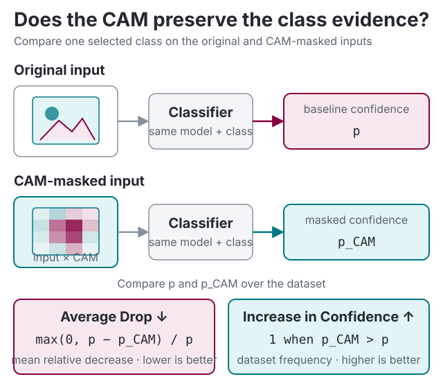

# Evaluation metrics

Apart from qualitative visual comparison, it is important to have a refined evaluation metric for class activation maps. This submodule is dedicated to the evaluation of CAM methods.

Both metrics compute CAMs from the model's raw output. A `logits_fn` such as softmax changes only the scores used to measure the explanation. It does not change the score differentiated by a gradient-based CAM. Class indices and callable `targets` select the same outputs before and after this score transform, so `logits_fn` must preserve that output layout.

Use `output_fn` when the model output needs an adapter. The adapter runs before both CAM extraction and metric scoring, including extra model calls inside methods such as ScoreCAM and SmoothGradCAMpp. It does not change the model output outside the metric update. For example, a model that returns a dictionary of batched logits can use:

```python
from functools import partial
from operator import itemgetter

import torch

from torchcam.metrics import ClassificationMetric

metric = ClassificationMetric(
    cam_extractor,
    logits_fn=partial(torch.softmax, dim=-1),
    output_fn=itemgetter("logits"),
)
metric.update(input_tensor)
```

If you previously used `logits_fn` to extract or reshape a model output, move that adapter to `output_fn`. Keep the probability transform in `logits_fn`. Native per-sample list outputs still work with callable `targets` and do not require an adapter. The target must accept the same per-sample structure from both the raw and transformed outputs.

Preserve the class identity and order expected by the CAM extractor when adapting outputs. For example, CAM selects classifier weight rows directly. Extracting `output["logits"]` preserves those class indices; an arbitrary class permutation is not supported across all CAM methods.

## Classification confidence



Average Drop uses the exact relative loss for each positive original confidence. It does not add an epsilon to the denominator, which would suppress drops at small confidence values. When the original confidence is zero, its drop is defined as zero. A larger masked confidence still counts as an increase.

Selected original and masked scores must be finite and nonnegative. Positive raw scores remain supported, but use probabilities to compare with published confidence metrics. Negative scores raise `ValueError`; Average Drop has no confidence-loss interpretation for a negative denominator. Use deletion/insertion for signed scalar targets.

Both metrics reject nonfinite selected scores with `ValueError` and leave their accumulated results unchanged. CAMs that contain NaNs are still skipped and counted by `nan_count`.

::: torchcam.metrics.ClassificationMetric
    options:
        members:
            - reset
            - update
            - summary

## Deletion and insertion faithfulness

[Deletion and insertion](https://arxiv.org/abs/1806.07421) measure how the model's selected-class score changes as spatial positions are perturbed in descending CAM order. For an input $X$, baseline $B$, and the set $R_t$ containing the top-ranked positions restored or removed by step $t$:

$$
D_t[p] =
\begin{cases}
B[p] & p \in R_t \\
X[p] & p \notin R_t
\end{cases}
$$

$$
I_t[p] =
\begin{cases}
X[p] & p \in R_t \\
B[p] & p \notin R_t.
\end{cases}
$$

The same spatial mask is applied to every input channel. If $x_t = |R_t| / P$ is the actual perturbed fraction for $P$ spatial positions and $s_c$ is the selected-class score, TorchCAM computes:

$$
\operatorname{DeletionAUC} = \operatorname{trapz}(s_c(D_t), x_t),
$$

$$
\operatorname{InsertionAUC} = \operatorname{trapz}(s_c(I_t), x_t).
$$

Lower deletion AUC and higher insertion AUC indicate a more faithful ranking. Both the unperturbed and fully perturbed endpoints are included. `steps` is the maximum number of intervals: each interval changes $\lceil P / \text{steps} \rceil$ positions, except for the shorter final interval, and integration uses the resulting fractions rather than an assumed uniform grid.

The default baseline is `zeros_like(input_tensor)`. This represents the dataset mean only when inputs were normalized so that the mean maps to zero. Baseline choice can introduce out-of-distribution evidence and materially change both scores. The original RISE evaluation used constant deletion values and a blurred insertion substrate, while this metric deliberately uses one baseline for both curves. To reproduce those two substrates, run the metric separately with each baseline and compare only the corresponding AUC.

`batch_size` limits how many perturbed inputs are scored in one forward pass. It bounds temporary memory but does not reduce the number of perturbed samples. With $S$ effective intervals, each valid input requires $2S - 1$ additional scoring samples, plus the original CAM-producing forward and any backward pass required by the extractor.

By default, the metric integrates raw model outputs. Pass a function such as softmax for probability curves comparable to the paper; raw-logit AUCs may fall outside $[0, 1]$ and should not be compared with probability AUCs.

Finite signed scalar scores are supported. Half-precision and bfloat16 scores are promoted to float32 before integration, so adjacent finite values do not overflow during half-precision addition.

```python
from functools import partial

import torch

from torchcam.methods import GradCAM
from torchcam.metrics import DeletionInsertionMetric

model.eval()
with GradCAM(model, "layer4") as cam_extractor:
    metric = DeletionInsertionMetric(
        cam_extractor,
        partial(torch.softmax, dim=-1),
        steps=20,
        batch_size=32,
    )
    metric.update(input_tensor)
    scores = metric.summary()
```

!!! warning

    Deletion and insertion test perturbation faithfulness to the model's score. They do not establish localization quality, human interpretability, or causal correctness outside the chosen perturbation and baseline protocol.

::: torchcam.metrics.DeletionInsertionMetric
    options:
        members:
            - reset
            - update
            - summary
